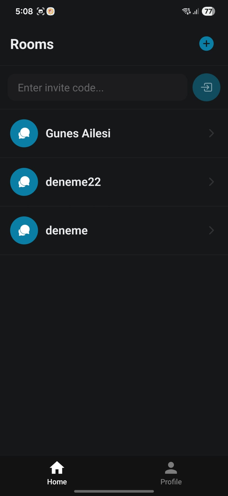
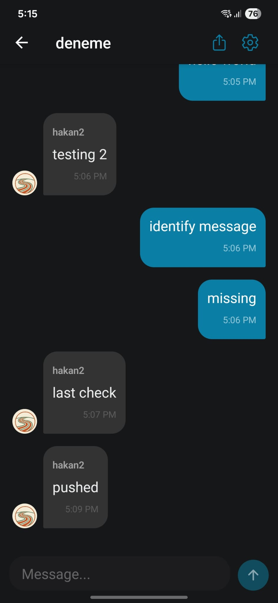
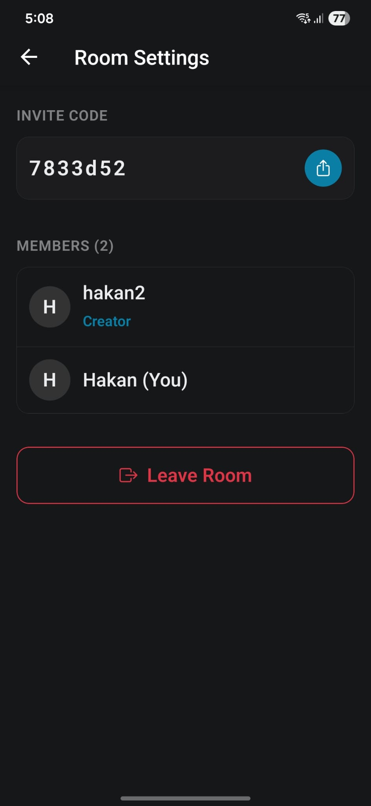
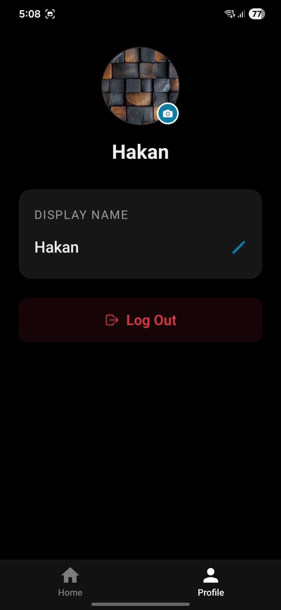

<div align="center">
  
  <h1>Yolcu Chat</h1>
</div>

This mobile app is a dedicated platform designed for building communities around specific interests. It streamlines the creation of hobby-based chat rooms, providing a focused space where enthusiasts can connect and share their passions in real time. By removing the clutter of general social networking, the app ensures that every conversation is centered on the hobbies that matter most to its users.

## ✨ Features

### Core Capabilities

- **Hobby-Based Chat Rooms:** Create and join rooms dedicated specifically to your interests and hobbies.
- **Real-Time Messaging:** Instant communication powered by Supabase Realtime for seamless interaction.
- **Push Notifications:** Stay updated with new messages and activity via integrated cross-platform notifications.
- **Room Management:** Full control to create rooms and customize settings for your community.
- **User Profiles:** Personalized identities to connect with like-minded individuals.

### Future Enhancements

- **Media Sharing:** Capability to share photos and videos directly within chat rooms to showcase hobby projects.
- **Event Scheduling:** Tools for organizing meetups or scheduled hobby sessions within room communities.
- **Advanced Moderation:** Expanded roles and permissions for community leaders to manage discussions.
- **Interest Matching:** Smart suggestions for new rooms based on your selected interests and profile.

## 📸 Screenshots

<p align="center">
  
  
  
  
</p>

## 🚀 Tech Stack

- **Frontend:** React Native, Expo, TypeScript, Expo Router
- **Backend:** Supabase (PostgreSQL, Auth, Realtime)

## 🛠 Setup

1. **Install Dependencies**

   ```bash
   cd frontend/my-app
   npm install
   ```

2. **Environment Setup**
   Ensure `lib/supabase.ts` is configured with your Supabase credentials, or use `.env` files if configured:

   ```env
   EXPO_PUBLIC_SUPABASE_URL=your_supabase_url
   EXPO_PUBLIC_SUPABASE_ANON_KEY=your_supabase_anon_key
   ```

3. **Firebase Push Notifications Setup**
   - **google-services.json**: Place your Firebase `google-services.json` file in:
     - `frontend/my-app/google-services.json` (root of the project)
   - **Firebase Private Key**: Upload your Firebase service account private key (JSON) to Expo for push notifications:
     ```bash
     npx eas credentials
     ```
     Then select "Android" → "Push Notifications: Manage your FCM API key" and upload your Firebase service account key.

4. **Build the app**

   ```bash
   npx expo run:android
   ```

5. **Run the App**

   ```bash
   npx expo start
   ```

6. **EAS Build**
   ```bash
   npx eas build
   ```

## 📂 Structure

- `app/`: Expo Router pages (Auth, Tabs, etc.)
- `lib/`: Supabase client configuration
- `components/`: Reusable UI components
